#  Internal Network Footprinting – Assessment Report

**Analyst:** _Tessa Anselm_  
**Date:** _May 26, 2025_  
**Engagement Scope:** Multi-host enumeration of internal infrastructure  
**Objective:** Identify exposed services, misconfigurations, and access paths leading to flag.txt file and the `HTB` user.

---

## 🔎 Summary of Targeted Hosts

| Target IP        | Focus Area               | Goal                                     |
|------------------|--------------------------|------------------------------------------|
| 10.129.185.174   | DNS & FTP                | Discover internal domain, gain shell via FTP |
| 10.129.106.61    | Windows SMB/NFS          | Extract user credentials through shared services |
| 10.129.184.197   | SNMP, Mail, MySQL        | Pivot from SNMP leak to DB password |

---

## 📁 Exercise 1: `10.129.185.174` – DNS Footprinting & FTP Shell Access

###  Tools & Techniques
- `dig`, `dig axfr`, `dnsmap`
- `nmap -sC -sV -Pn -p21,22,53`
- FTP enumeration and file extraction
- SSH login via stolen private key

###  Key Findings
- Domain discovered: `ftp.int.inlanefreight.htb`
- FTP banner leaked internal hostname
- Downloaded `.ssh/id_rsa` from FTP
- Gained SSH access as `ceil`

###  Outcome
- Achieved initial shell on the host
- Found user SSH keys and `.bash_history`

###  Steps Port 2121: FTP Access
1. **FTP Enumeration on Port 2121**  
   Initial enumeration revealed a non-standard FTP port. Connecting revealed accessible directories.  
   `ftp 10.129.185.174 2121`  
   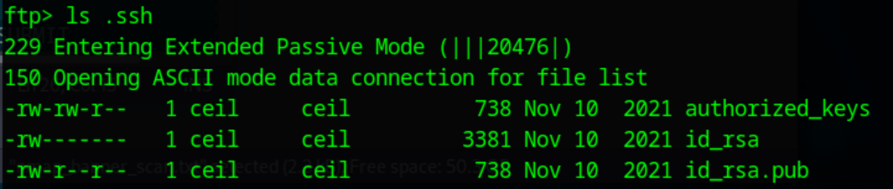

2. **Private SSH Key Discovered**  
   Navigated to `.ssh` and downloaded `id_rsa`.  
   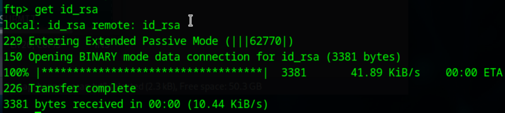

3. **SSH Access as `ceil` & Flag Discovery**  
   Used downloaded key for login and searched for flags.  
   ```bash
   chmod 600 id_rsa
   ssh -i id_rsa ceil@10.129.185.174
   find / -iname flag.txt 2>/dev/null
   ```

	Found the flag in `/home/flag/flag.txt`:  
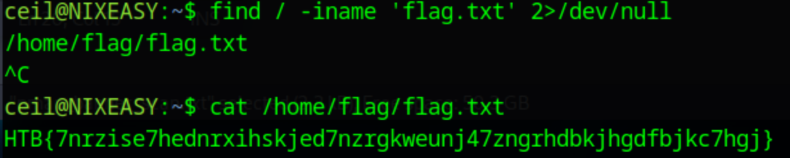

---

##  Exercise 2: `10.129.106.61` – Windows SMB/NFS Enumeration

###  Tools & Techniques
- `nmap -sC -sV -Pn -p135,139,445,111,2049`
- `showmount -e`, `mount -t nfs`
- `smbclient`, `crackmapexec`, `enum4linux-ng`

###  Key Findings
- NFS shared folder: `/TechSupport` accessible to everyone
- Found file `important.txt` containing:
  - `user: alex`
  - `password: lol123!mD`
- Validated SMB login with `alex`
- WinRM present but not accessible to `alex`

###  Outcome
- Gained Windows user-level access via SMB
- Could enumerate internal shares and services

###  Steps NFS Access on Port 2049

1. **NFS Export Scan & Mount**  
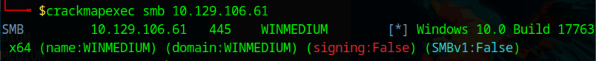

	**NFS share found via showmount:**  
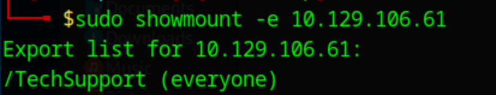  
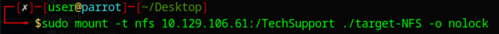

3. **Extracted credentials from ticket file**  
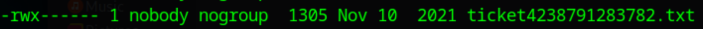  
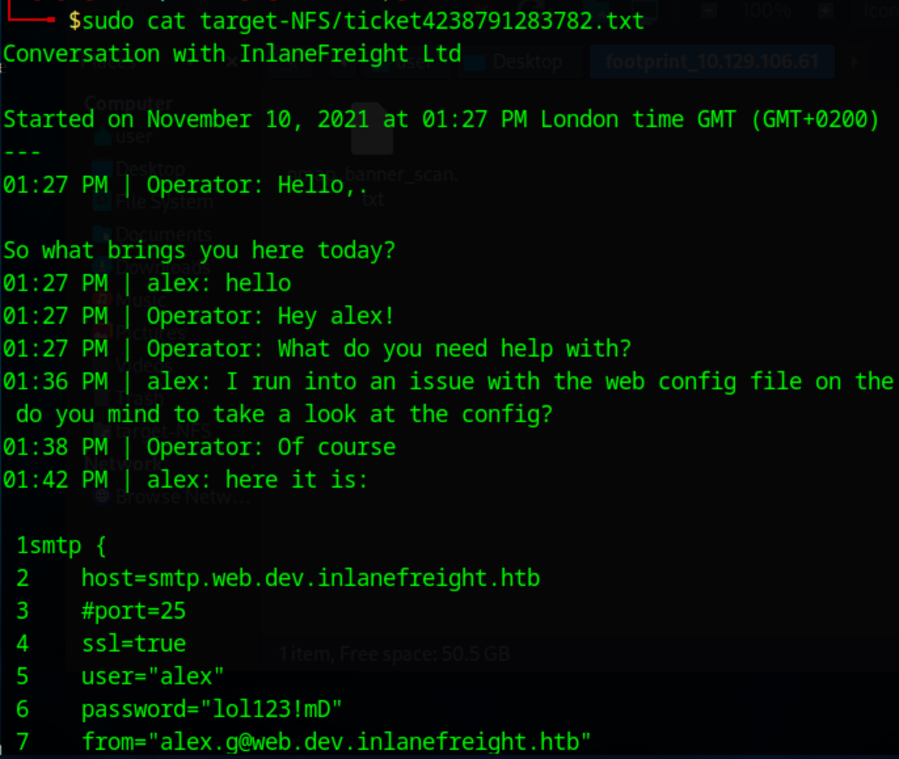

4. **SMB Enumeration with `alex`**  
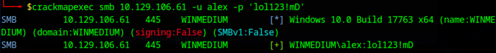

5. **Found `important.txt` with more creds**  
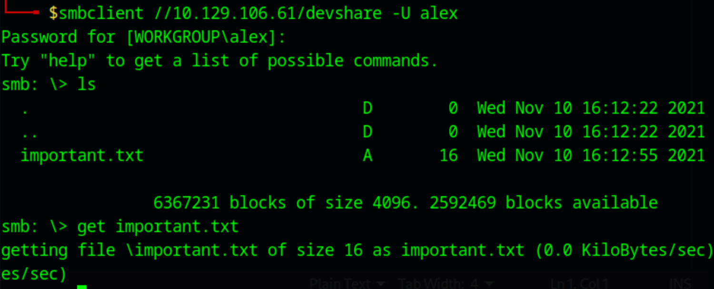  
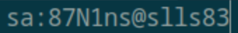

6. **RDP and SQL Login via SSMS**  
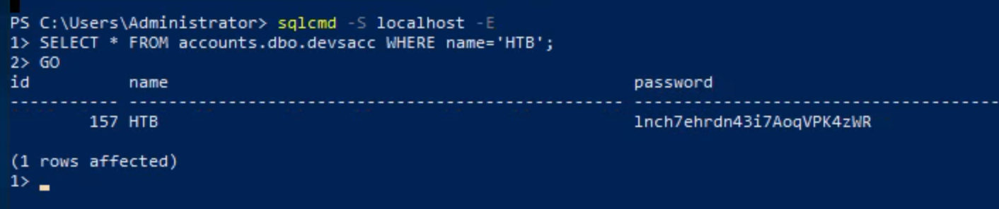  
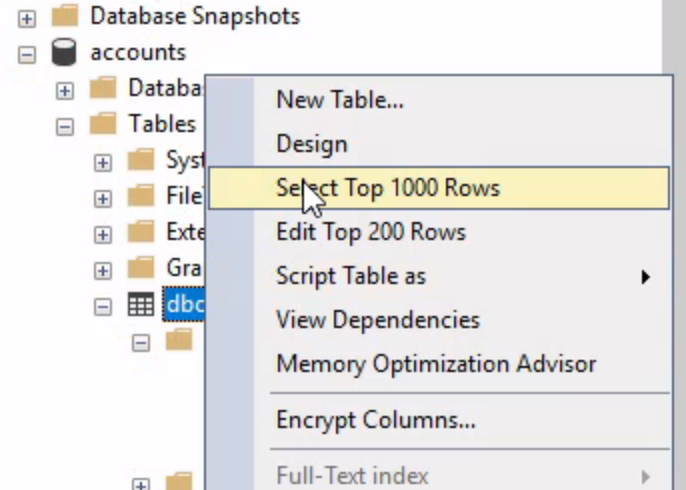  
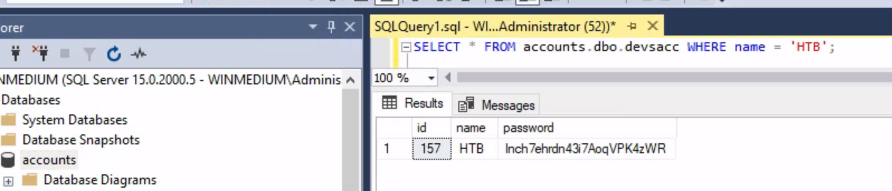

---

##  Exercise 3: `10.129.184.197` – SNMP, IMAP, MySQL & Credential Extraction

###  Tools & Techniques
- `snmpwalk`, `onesixtyone`, `snmp-check`
- `openssl s_client -connect :993`
- SSH to user `tom` via SNMP info
- MySQL login & internal query

###  Key Findings
- SNMP exposed full `/etc/passwd`
- User `tom` had SSH enabled and credentials were found
- Inside `tom`’s session, MySQL revealed:
  - User `HTB` with stored credentials
  - Valid authentication

###  Outcome
- Gained credentials for HTB user
- Verified access to MySQL database

### Steps
1. **SNMP Leak Discovery**  
   Leaked `/etc/passwd`, recovery script path, and credential string via SNMP.  
   Command used:  
   `snmpwalk -v2c -c backup 10.129.184.197`

   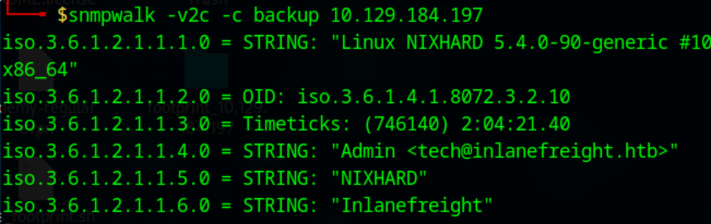  
   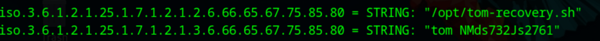

2. **Logged into IMAP to Fetch SSH Key**  
   Used leaked credentials `tom:NMds732Js2761` to authenticate.  
   Command used:  
   `openssl s_client -connect 10.129.184.197:imaps`  
   Login string:  
   `1 LOGIN tom NMds732Js2761`  

   Found inbox message from admin containing private SSH key.

   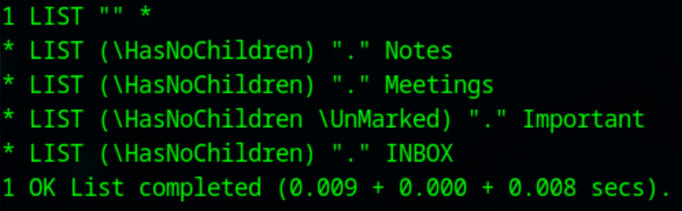  
   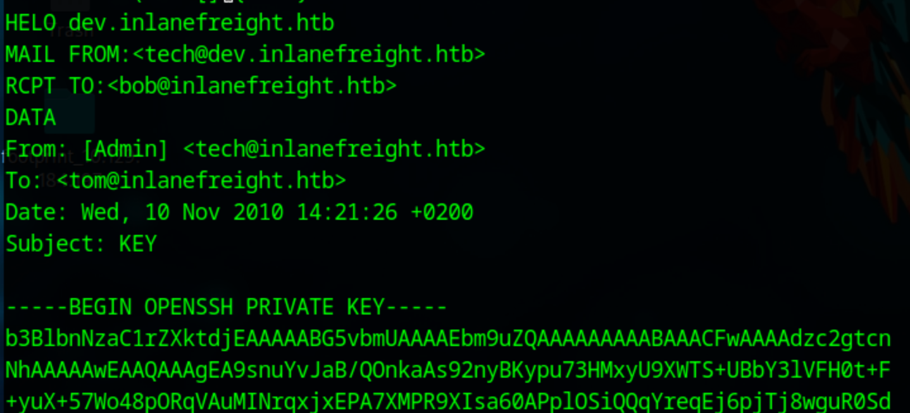  

3. **SSH into Tom’s Account & Query MySQL**  
   SSH into the machine using the stolen key, then access MySQL and extract credentials:

   **SSH & MySQL Login:**
   ```bash
   ssh -i id_rsa_tom tom@10.129.184.197
   mysql -u tom -p
   # Password: NMds732Js2761
   ```

   **SQL Queries to Extract HTB Credentials:**
   ```sql
   SHOW DATABASES;
   USE users;
   SHOW TABLES;
   SELECT * FROM users WHERE username = "HTB";
   ```

   

---

##  Credential Summary

| User     | Credential         | Source             | Method                  |
|----------|--------------------|--------------------|-------------------------|
| `ceil`   | SSH private key    | FTP server         | File extraction         |
| `alex`   | `lol123!mD`        | NFS share          | File read via mount     |
| `tom`    | SNMP-discovered    | SNMP `/etc/passwd` | SSH brute/check         |
| `HTB`    | Extracted password | MySQL              | Query via `tom` shell   |

---

##  Recommendations

###  Exercise 1 (DNS/FTP)
- Disable anonymous FTP or restrict read/write permissions
- Remove sensitive files from public directories
- Rotate SSH keys regularly and audit authorized keys

###  Exercise 2 (SMB/NFS)
- Limit NFS shares to specific hosts
- Audit access controls for SMB shares
- Rotate exposed credentials and monitor failed login attempts

###  Exercise 3 (SNMP/DB)
- Restrict SNMP to authorized IPs and disable public community strings
- Use MySQL user privilege separation
- Avoid plaintext credential storage in config/database

---

##  Notes

- All enumeration was performed passively or with safe scanning flags unless authorized otherwise.
- Logs, screenshots, and scan results are retained in the `footprint_<ip>` directories.
-  Script created to run automated enumeration:
```bash
#!/bin/bash

# Usage: ./footprint.sh <target-ip>
# Description: Automated footprinting, DNS recon, service-based scans, and recommendations

set -u

TARGET="$1"
OUTDIR="footprint_$TARGET"
WORDLIST="/usr/share/wordlists/dnsmap.txt"
mkdir -p "$OUTDIR"
cd "$OUTDIR" || exit

echo "[+] Recon started for: $TARGET"
echo "[+] Output folder: $OUTDIR"
DOMAIN=""

# ---------------------------------------------
# DNS PHASE 1: Reverse DNS Lookup
echo "[*] Reverse DNS lookup..."
dig -x "$TARGET" +short > reverse_dns.txt
DOMAIN=$(sed 's/\.$//' reverse_dns.txt | awk -F. '{OFS="."; if (NF>=3) print $(NF-2),$(NF-1),$NF}')

if [[ -z "$DOMAIN" ]]; then
    echo "[!] Reverse DNS failed. Trying dig ANY..."
    dig any @"$TARGET" > dig_any.txt
    DOMAIN=$(grep -Eo '[a-zA-Z0-9.-]+\.(lan|local|internal|corp|htb)' dig_any.txt | head -n1)
fi

if [[ -z "$DOMAIN" ]]; then
    echo "[!] Brute-forcing domain guesses via AXFR..."
    COMMON_DOMAINS=(internal corp lan dev private company domain)
    COMMON_TLDS=(local lan internal corp intranet)
    for ROOT in "${COMMON_DOMAINS[@]}"; do
        for TLD in "${COMMON_TLDS[@]}"; do
            TRY="$ROOT.$TLD"
            dig axfr "$TRY" @"$TARGET" > "axfr_guess_$TRY.txt"
            if grep -q "IN" "axfr_guess_$TRY.txt"; then
                DOMAIN="$TRY"
                break 2
            else
                rm -f "axfr_guess_$TRY.txt"
            fi
        done
    done
fi

# Fallback: use Nmap banner to guess domain
if [[ -z "$DOMAIN" ]]; then
    echo "[!] Final fallback: grabbing domain from banner..."
    nmap -sC -sV -Pn "$TARGET" -oN nmap_banner.txt
    DOMAIN=$(grep -Eo '[a-zA-Z0-9.-]+\.(lan|local|internal|corp|htb)' nmap_banner.txt | head -n1)
fi

echo "[✔] Discovered domain: $DOMAIN"

# ---------------------------------------------
# DNS PHASE 2: AXFR + Subdomain bruteforce
if [[ -n "$DOMAIN" ]]; then
    dig axfr "$DOMAIN" @"$TARGET" > axfr_final.txt
    grep -q "IN" axfr_final.txt || rm -f axfr_final.txt

    echo "[*] Subdomain brute-force..."
    touch subdomains.txt
    while read -r sub; do
        RES=$(dig +short "$sub.$DOMAIN" @"$TARGET")
        [[ -n "$RES" ]] && echo "$sub.$DOMAIN - $RES" | tee -a subdomains.txt
    done < "$WORDLIST"
    [[ ! -s subdomains.txt ]] && rm -f subdomains.txt
fi

# ---------------------------------------------
# NMAP SCANS (TCP + UDP)
echo "[*] Running TCP port scan..."
nmap -sC -sV -p- -T4 -Pn "$TARGET" -oN nmap_tcp_full.txt

echo "[*] Running common UDP port scan..."
sudo nmap -sU -T4 -F "$TARGET" -oN nmap_udp_common.txt

# ---------------------------------------------
# ENUMERATE SERVICES BASED ON PORTS
echo "[*] Analyzing results for service-specific enumeration..."

extract_ports() {
    grep -Eo "^[0-9]+/tcp" nmap_tcp_full.txt | cut -d'/' -f1
}

for PORT in $(extract_ports); do
    case "$PORT" in
        21)
            mkdir -p FTP && echo "📌 FTP found on port 21. Try: ftp $TARGET or anonymous login" > FTP/note.txt
            sudo nmap -p21 -sV -sC "$TARGET" -oN FTP/nmap_ftp.txt
            ;;
        139|445)
            mkdir -p SMB && echo "📌 SMB found. Try: smbclient -L //$TARGET -N" > SMB/note.txt
            sudo nmap -p139,445 -sV -sC "$TARGET" -oN SMB/nmap_smb.txt
            ;;
        2049)
            mkdir -p NFS && echo "📌 NFS found. Try: showmount -e $TARGET" > NFS/note.txt
            sudo nmap -p111,2049 -sV -sC "$TARGET" -oN NFS/nmap_nfs.txt
            ;;
        53)
            mkdir -p DNS && echo "📌 DNS found. Try: dig axfr $DOMAIN @$TARGET" > DNS/note.txt
            sudo nmap -p53 -sV -sC "$TARGET" -oN DNS/nmap_dns.txt
            ;;
        25|587)
            mkdir -p SMTP && echo "📌 SMTP found. Try: telnet $TARGET 25" > SMTP/note.txt
            sudo nmap -p25,587 -sV -sC "$TARGET" -oN SMTP/nmap_smtp.txt
            ;;
        110|143|993|995)
            mkdir -p IMAP_POP3 && echo "📌 Email service found. Try openssl s_client -connect $TARGET:993" > IMAP_POP3/note.txt
            sudo nmap -p110,143,993,995 -sV -sC "$TARGET" -oN IMAP_POP3/nmap_imap_pop.txt
            ;;
        161)
            mkdir -p SNMP && echo "📌 SNMP found. Try: snmpwalk -v2c -c public $TARGET" > SNMP/note.txt
            sudo nmap -sU -p161 -sV -sC "$TARGET" -oN SNMP/nmap_snmp.txt
            ;;
        3306)
            mkdir -p MySQL && echo "📌 MySQL found. Try: mysql -h $TARGET -u root -p" > MySQL/note.txt
            sudo nmap -p3306 -sV -sC "$TARGET" -oN MySQL/nmap_mysql.txt
            ;;
        1433)
            mkdir -p MSSQL && echo "📌 MSSQL found. Try: mssqlclient.py sa@$TARGET -windows-auth" > MSSQL/note.txt
            sudo nmap -p1433 -sV -sC "$TARGET" -oN MSSQL/nmap_mssql.txt
            ;;
        623)
            mkdir -p IPMI && echo "📌 IPMI found. Try: ipmitool -I lanplus -H $TARGET -U root -P '' power status" > IPMI/note.txt
            sudo nmap -p623 -sU -sV -sC "$TARGET" -oN IPMI/nmap_ipmi.txt
            ;;
    esac
done

# ---------------------------------------------
# CLEANUP
echo "[*] Cleaning up empty or irrelevant files..."
find . -type f -name "*.txt" -size 0 -delete

# ---------------------------------------------
# COMPLETE
echo -e "\n[✔] Enumeration complete for $TARGET"
echo "[📁] Output stored in: $OUTDIR"
echo "[!] Review service folders and consider next actions like:"
echo "   - FTP: Try anonymous login (ftp $TARGET)"
echo "   - SMB: Use smbclient or crackmapexec to check access"
echo "   - NFS: Try showmount and mount"
echo "   - SNMP: Use snmpwalk for public strings"
echo "   - MSSQL: Use mssqlclient.py or Metasploit scanners"
```

---
## Credential Summary

| User     | Credential         | Source             | Method                  |
|----------|--------------------|--------------------|-------------------------|
| `ceil`   | SSH private key    | FTP server         | File extraction         |
| `alex`   | `lol123!mD`        | NFS share          | File read via mount     |
| `tom`    | SNMP-discovered    | SNMP `/etc/passwd` | SSH brute/check         |
| `HTB`    | Extracted password | MySQL              | Query via `tom` shell   |

---
**End of Report**
